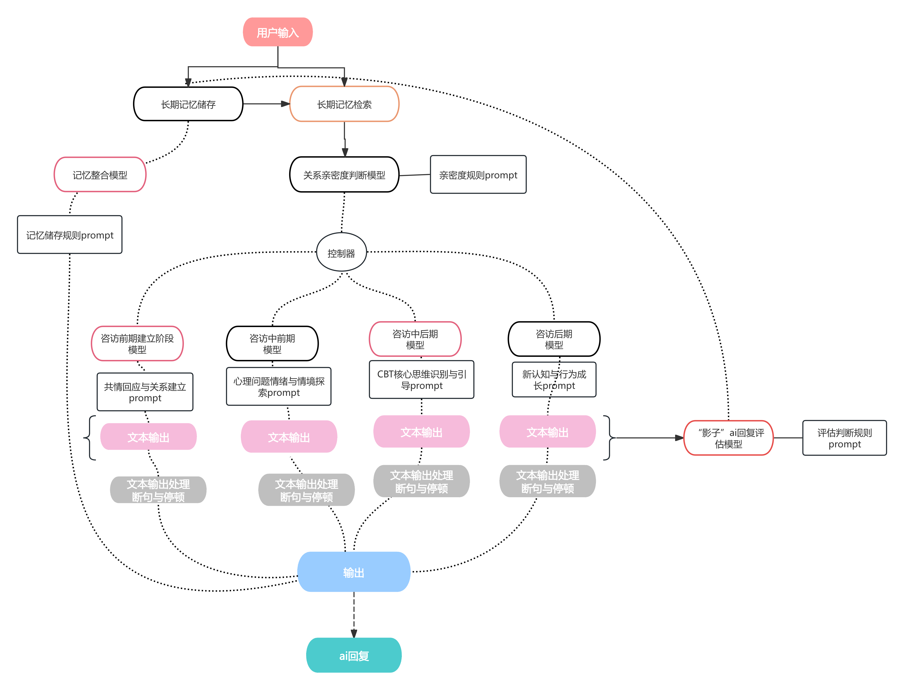

# Agent Workflow
# 智能体工作流设计

This document explains the workflow of the Emotion-Aware AI Agent.

（本文档说明 Emotion-Aware AI Agent 的整体工作流程设计）

---

## Workflow Overview
## 工作流概览

The AI Agent follows a structured multi-step workflow to provide emotionally supportive conversations.  
Instead of generating random responses, the system uses stage-based dialogue management, memory retrieval, and prompt control.

（该智能体采用结构化工作流进行对话管理，而不是简单随机回复。  
系统通过阶段控制、记忆检索和 Prompt 策略管理对话。）

---

## Workflow Steps
## 工作流程步骤

### 1. User Input
用户输入

The system receives user messages and prepares them for analysis.

系统接收用户输入并进行基础处理。

---

### 2. Memory Storage & Retrieval
长期记忆存储与检索

The system retrieves relevant historical interactions from the memory database.

系统从长期记忆库中检索相关历史对话信息。

This helps the AI maintain conversation continuity.

帮助 AI 保持对话连续性；利于后期对于来访者亲密度判断等等。

---

### 3. Emotion Detection & State Analysis
情绪识别与状态分析

The model analyzes emotional tone and contextual meaning in the user message.

系统识别用户情绪、语气与语义上下文。

---

### 4. Conversation Stage Classification
对话阶段判断

The system determines which stage the conversation is currently in:

系统判断当前对话所处阶段从而进行分流处理：

• Engagement（关系建立阶段）  
• Exploration（问题探索阶段）  
• Intervention（认知干预阶段）  
• Closure（总结与结束阶段）

---

### 5. 多阶段模型与Prompt Strategy 
Prompt策略选择

Based on the stage and context, the system selects an appropriate prompt template.

根据当前阶段与上下文选择对应阶段模型与 Prompt 模板。

This ensures stable dialogue behavior and psychological interaction logic.

保证 AI 回复的稳定性和心理学逻辑。

---
### 6. Response Review Model
回复审核与评估模型

After generating a response, the system sends the output to a review model.

系统在生成回复后，将该回复发送至审核模型进行评估。

The review model evaluates the response based on several criteria:

审核模型根据多个维度对回复进行评分，例如：

• Emotional appropriateness（情绪共情程度）  
• Dialogue coherence（对话连贯性）  
• Psychological support quality（心理支持质量）  
• Safety compliance（安全与伦理规则）

The evaluation results are stored in the memory system.

评估结果会被存入长期记忆系统。

This feedback can influence future dialogue responses and improve interaction quality.

这些反馈会影响后续对话，使模型逐步优化互动质量。

### 7. Sentence Segmentation & Pause Handling
断句与停顿处理

The generated response is segmented into natural sentences.

系统对回复进行断句处理。

Short pauses are inserted between sentences to simulate human-like conversation rhythm.

句子之间加入短暂停顿，使对话更自然。

---

### 8. Response Generation
回复生成

The final response is delivered to the user.

系统生成最终回复并返回给用户。

The conversation memory is updated for future interactions.

同时更新长期记忆库。

---

## Workflow Diagram
## 工作流图

Below is the workflow diagram of the system.

（以下为系统工作流图）

